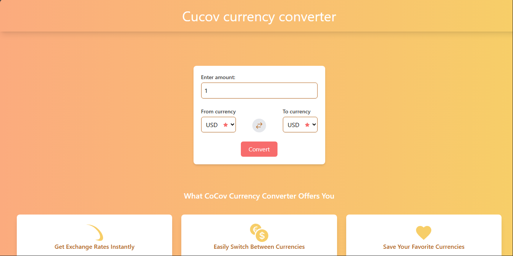

# Cocov-Pro

**Cocov-Pro is a currency conversion application built with React and Tailwind CSS. It allows users to convert currencies in real-time by fetching live exchange rates from a public API. The app is designed with a responsive layout for seamless usage on desktop, tablet, and mobile devices.**

## Screenshots of  Cocov-Pro

*Desktop screen*
 

*Tablet screen*
 

*Mobile screen*
 

## Features
1. **Real-Time Currency Conversion**: Convert currencies between different countries using up-to-date exchange rates.
2. **Wide Range of Currencies**: Select from a broad range of currencies to calculate conversions.
3. **Responsive Design**: Optimized for all screen sizes, ensuring a smooth user experience on desktop, tablet, and mobile devices.
4. **Save Your Favorite Currencies**: Save and access your frequently used currencies for quicker conversions.
5. **Social Media Integration**: Contact me via social media links available in the app.

## Installation
To run the Cocov-Pro project locally, follow these steps:

1. Clone the repository:

bash
Copy code
*[git clone] (https://github.com/G-essien/cocov-pro)*

2. Navigate to the project directory:

bash
Copy code
*cd cocov-pro*

3. Install the required dependencies:

bash
Copy code
*npm install*

4. Start the development server:

bash
Copy code
*npm start*

5. The app will run on http://localhost:3000

## Build for Production

1. To build the project for production, run:

bash
Copy code
*npm run build*
This will create an optimized build in the build folder, ready to be deployed.

## Project Structure
1. src/: Contains the source code of the project.
2. components/: Reusable components used across the app.
3. pages/: Main pages like Home, About, and Contact.
4. styles/: Contains the CSS files, mainly styled with Tailwind CSS.
5. hooks/: Custom React hooks for handling logic such as currency conversion.
6. public/: Contains static assets like icons, manifest files, and index.html.

## Technologies Used
1. React: JavaScript library for building user interfaces.
2. Tailwind CSS: Utility-first CSS framework for styling.
3. React Router: For handling app routing.
4. Currency API: Fetching real-time exchange rates.
5. Netlify: For deployment of the application.
Future Enhancements
6. Favorites List: Allow users to mark favorite currencies for quick access.

**Contributing** *If you'd like to contribute to Cocov-Pro, feel free to open issues and submit pull requests. All contributions are welcome!*

## License
This project is licensed under the MIT License. See the LICENSE file for details.

## Contact
For any inquiries or feedback, please reach out via:

[Email:] (esseingodfred88@gmail.com) 
[GitHub:] (https://github.com/G-essien/)
